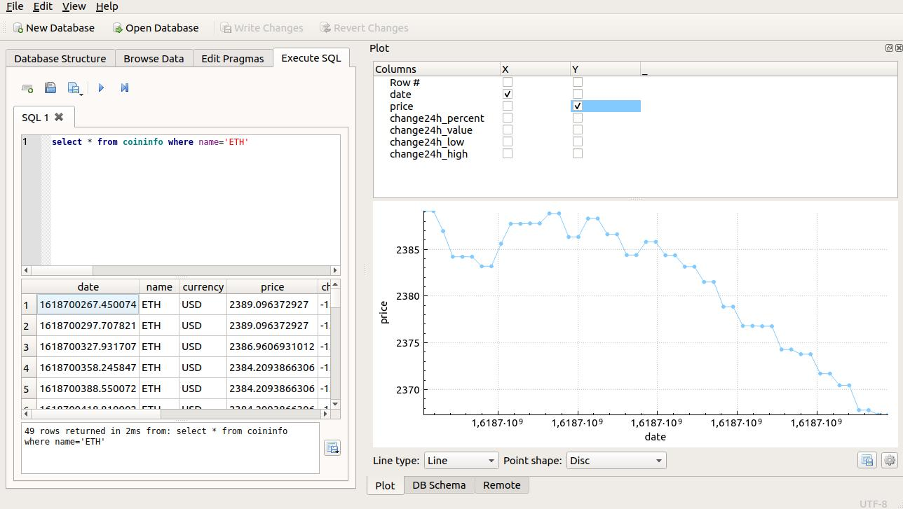

# Crypto coin data recorder

This application retrieves the crypto coin information from CoinDesk [1], filters the useful information, formats it, and records it in an SQLite database. After data is recorded, easily can be accessed or used by other applications. Below a simple visualization with a DB Browser.

The following data will be stored for the chosen crypto coins:
```
timestemp, name, currency, price, change24Hr_percent, change24Hr_value, change24Hr_low, change24Hr_high
```
<p align="center"> 
  </a>
</p>

Note: a timestamp is a DateTime object converted to a timestamp for easier storage, can be decoded with:

```
datetime.fromtimestamp (timestamp), returns "%Y-%m-%d %H:%M:%S"
```

## How to use

Use the following command-line arguments to customize the recorder:
```
usage: coin_data_recorder.py [-h] [-db DB] [-c C] [-coins COINS]

Crypto coin data recorder. Deaults: -db ./data/coininfo.db -c 30 -coins "ETH"

optional arguments:
  -h, --help    show this help message and exit
  -db DB        database to store info
  -c C          Frequency in seconds to asks for new data the recorder
  -coins COINS  String with a list of coins to be tracked, like "ETH, XRP"

```
There is also a test application available, to visualize the formatted dictionary elements:
```
[{'name': 'ETH', 'currency': 'USD', 'price': 2272.095974098, 'change24Hr_percent': -7.476082316153418, 'change24Hr_value': -183.5890325202, 'change24Hr_low': 2270.4204566642, 'change24Hr_high': 2495.9216094439}, {'name': 'XRP', 'currency': 'USD', 'price': 1.5057230034, 'change24Hr_percent': -4.54509405777551, 'change24Hr_value': -0.0716951382, 'change24Hr_low': 1.5043063811, 'change24Hr_high': 1.7427033332}]
```


## Links
[CoinDesk API](https://www.coindesk.com/coindesk-api)

/Enjoy.
